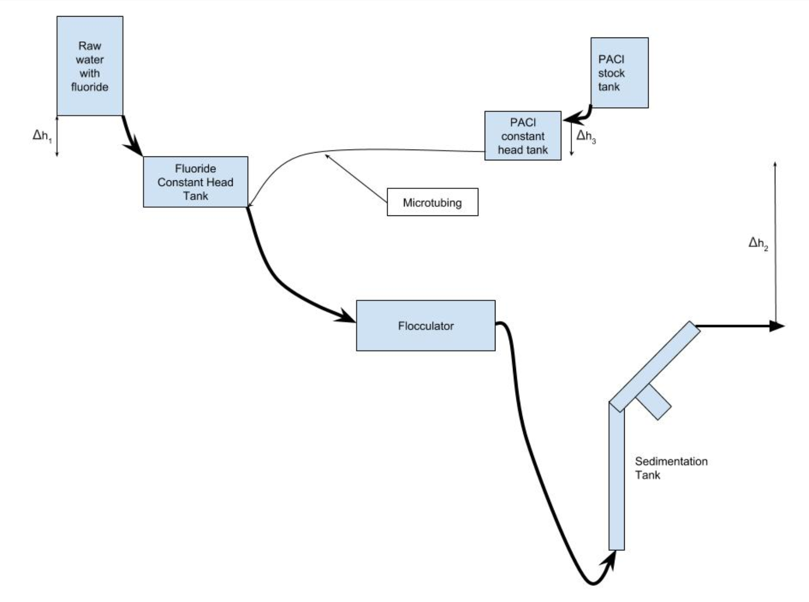
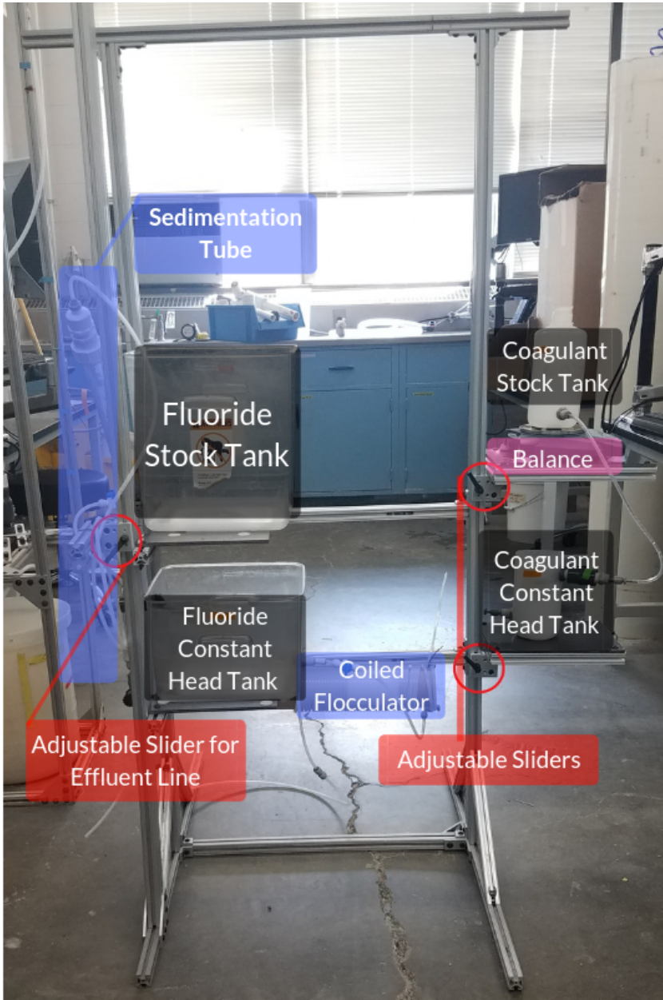
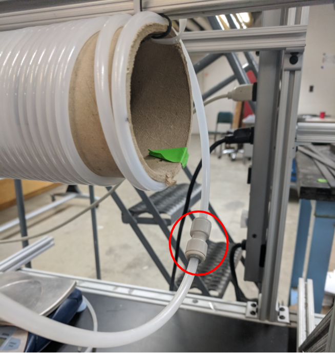
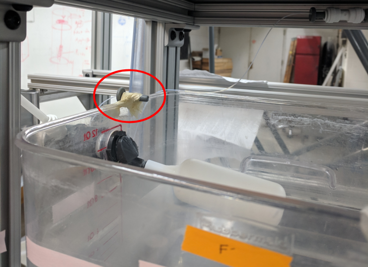
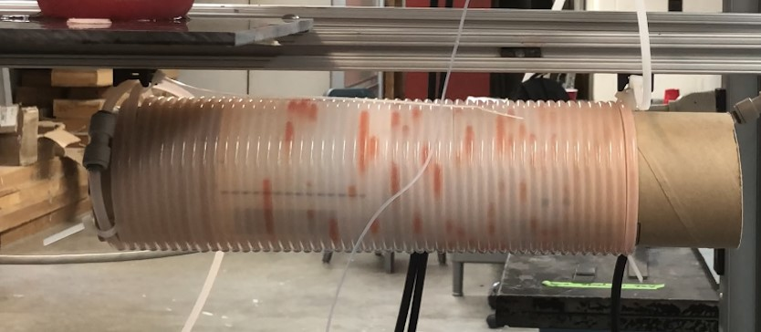

# Fluoride Gravity, Spring 2019
#### Sarah Huang, Cindy Jin, Simar Kohli
#### April 12, 2019
This publication Fluoride, Spring 2019 was developed under Assistance Agreement No. SU-83695001 awarded by the U.S. Environmental Protection Agency to Cornell University. It has not been formally reviewed by EPA. The views expressed in this document are solely those of Sarah Huang, Cindy Jin, and Simar Kohli and do not necessarily reflect those of the Agency. EPA does not endorse any products or commercial services mentioned in this publication.

## Abstract
Fluoride contamination of water is a significant issue faced by nations and people across the globe and can lead to adverse consequences on health (e.g. muscle weakness and atrophy, weakness, fatigue). The Fluoride Gravity team’s objective is to develop a cost-effective, self-sufficient mechanism for extracting excess fluoride from drinking water. The Spring 2019 team hopes to further the gravity-powered system’s efficacy and potentially begin to run field-tests with the device. The application of such a device in real-world scenarios will be predicated upon success seen with the aforementioned field tests.


## Introduction
The majority of AguaClara plants are located in Central America, where the sources of surface water originate from rivers and mountain streams. AguaClara's mission of providing access to safe drinking water for all has motivated the AguaClara team to expand and develop new goals. By considering and analyzing the differences in drinking water collected from groundwater sources in other regions around the world, AguaClara can serve communities outside of Central America who are deprived of access to safe drinking water.

At some locations where there is little to no fluoride in drinking water, fluoride is added in for the purpose of strengthening teeth and deteriorating natural deposits [(NYC DEP, 2016)](http://www.nyc.gov/html/dep/pdf/wsstate16.pdf). However, there are detrimental consequences when there is an excess concentration of fluoride in the water being consumed by inhabitants in the area. For example, there has been moderate to high fluoride pollution in regions such as Algeria, Thailand, Ghana, India, and Iran, whose major source of drinking water comes from groundwater sources. The pollution of groundwater in these regions is due to the mobile dissolution of fluorite, apatite, and topaz from weathered rocks, increasing the levels of fluoride in the groundwater [(Bhattacharya and Samal, 2018)](http://www.isca.in/rjrs/archive/v7/i4/6.ISCA-RJRS-2018-028.pdf). The effects of consuming excess fluoride include dental, skeletal, developmental, neurological, endocrine, reproductive, and carcinogenic issues that affect the health of the communities in areas of high fluoride concentrations [(Bhattacharya and Samal, 2018)](http://www.isca.in/rjrs/archive/v7/i4/6.ISCA-RJRS-2018-028.pdf). Therefore, the World Health Organization (WHO) regulated the concentration limit for fluoride in drinking water to be 1.5 mg/L [(Water-related diseases, 2016)](https://www.who.int/water_sanitation_health/diseases-risks/diseases/fluorosis/en/).

In India, the Bureau of India Standards set an upper limit of fluoride concentrations in drinking water to be 1 mg/L [(Bureau of India Standards, 2012)](https://archive.org/details/gov.in.is.10500.2012). However, more than 65 million Indians consume drinking water above the recommended limit of 1.5 mg/L and some locations in India contain up to 20 mg/L, which risks the health of many communities [(LeChevallier and Au, 2004)](https://www.who.int/water_sanitation_health/publications/9241562552/en/).

AguaClara aspires to achieve the recommended limit of 1 mg/L or lower by the Bureau of India Standards and to implement the gravity-powered system of fluoride removal into the communities with excess concentrations of fluoride. The Fluoride Gravity team will be testing the gravity-powered apparatus with PACl and red dye substituted as fluoride to optimize fluoride removal to achieve residual concentration of less than 1 mg/L. If the gravity-powered fluoride removal apparatus operates in the optimal conditions of removing fluoride to a concentration of 1 mg/L, feasibility analysis on site will be performed to test whether the system can be used in the communities in India, which will allow AguaClara to provide access to safe drinking water in India and other locations that obtain water from groundwater sources.


## Literature Review
### Interaction between Polymeric Aluminum Hydroxide with Fluoride
When hydrolyzed, polyaluminum based coagulants, one of which is polyaluminum chloride, formed mono- and polymeric species [(Gebbie, 2001)](http://wioa.org.au/conference_papers/2001/pdf/paper6.pdf). The interaction between aluminum hydroxide polymer and fluoride led to the formation of several insoluble and soluble products depending on the ratio of total fluoride ion and aluminum ion concentrations, pH, and the total applied fluoride and aluminum concentrations [(Parthasarathy et al., 1986)](http://www.nrcresearchpress.com/doi/abs/10.1139/v94-310). When pH was less than 4, the predominant fluorocomplex was AlF due to the complete dissociation of polymeric aluminum. When the ratio of total fluoride ion and aluminum ion concentrations was between 0.5 and 1, fluoride was observed to precipitate, replacing some of the hydroxide ions in the aluminum hydroxide polymer. When the ratio of total fluoride ion and aluminum ion concentration was greater than 3, there is both precipitate and dissolved complexed fluoride present. It was observed that the optimal conditions for precipitating fluoride was a hydroxide to aluminum ratio of 2.5, a fluoride to aluminum ratio of 0.7, and a pH between 4 and 7. Therefore, experiments should aim to achieve the optimal hydroxide to aluminum and fluoride to aluminum ratios, as well as pH, predicted by literature.


### Mechanisms Governing Removal of Fluoride
Of the potential mechanisms that may play a role in the removal of fluoride with polyaluminum chloride, including surface adsorption, coprecipitation, and precipitation, it appeared that coprecipitation is the main mechanism [(Kowalchuk, 2011)](https://digitalrepository.unm.edu/cgi/viewcontent.cgi?referer=https://www.google.com/&httpsredir=1&article=1059&context=ce_etds). Coprecipitation is the contamination of a precipitate by an impurity that is otherwise soluble under the conditions of precipitation [(Randtke in Kowalchuk, 2011)](https://digitalrepository.unm.edu/cgi/viewcontent.cgi?referer=https://www.google.com/&httpsredir=1&article=1059&context=ce_etds). Occlusion and surface adsorption played major roles in this process.

### Interactions Among Fluoride, NOM, and Alum During Coagulation Process
Experimental results from jar tests illuminated mechanisms of behind fluoroaluminum complexation [(Herrboldt, 2016)](https://repositories.lib.utexas.edu/bitstream/handle/2152/39194/HERRBOLDT-THESIS-2016.pdf?sequence=1). When fluoride was present in the system with alum, the residual aluminum increased significantly, indicating that fluoride is likely forming a soluble fluoroaluminum complex. In the removal of fluoride, the presence of natural organic matter (NOM) caused a small decrease in fluoride removal from 50.1% to 45.8%, whereas NOM removal was greatly inhibited by the presence of fluoride [(Herrboldt, 2016)](https://repositories.lib.utexas.edu/bitstream/handle/2152/39194/HERRBOLDT-THESIS-2016.pdf?sequence=1). This indicates that in the removal of fluoride, fluoride was likely outcompeting NOM for complexation with aluminum or adsorption to aluminum solids.

In the precipitation of aluminum with fluoride, fluoride was predicted to act in the following manner: since fluoride is a negatively charged species, fluoride must overcome the negative charge repulsion between particles in order to allow for aggregation. In the precipitation of fluoride with aluminum, the disruption of charges due to the negative repulsion stops collisions and ultimately causes particles to be concentrated at smaller particle diameters [(Herrboldt, 2016)](https://repositories.lib.utexas.edu/bitstream/handle/2152/39194/HERRBOLDT-THESIS-2016.pdf?sequence=1). In this manner, fluoride may inhibit the aggregation of flocs by acting as a stabilizing agent or by inhibiting precipitation. It was hypothesized that fluoride prevented the growth of precipitates by inhibiting interactions between hydroxide and nearby particles. It was also hypothesized that, due to the way that fluoride can replace hydroxide in solids , the formation of aluminum hydroxide complexes would be disrupted.

### pH Dependence of Fluoride Removal
In a study by Gong et al. (2012), fluoroaluminum complexation was found to exhibit pH dependence. At pH values less than 5.0, almost all fluoride existed as fluoro-aluminum complexes, inhibiting its removal by coagulation. At pH levels greater than 8.0, fluoride almost exclusively as free fluoride, indicating that hydroxide has a greater affinity for aluminum at a higher pH [(Herrboldt, 2016)](https://repositories.lib.utexas.edu/bitstream/handle/2152/39194/HERRBOLDT-THESIS-2016.pdf?sequence=1). Thus, all experiments should be run in the optimal pH range for fluoride removal.

### Collection and Analysis of Fluoride samples
An Ion-Selective Electrode (ISE) fluoride probe is used to measure the fluoride concentration of a sample. The following quality-control procedures should be followed.

ISE fluoride probes can only detect solubilized fluoride, and would give inaccurate readings in the presence of Fe3+ and Al3+, such as in cases where polyaluminum chloride is added to the system. Total Ionic Strength Adjusting Buffer (TISAB) solution is added to samples to solubilize the fluoride in the sample and keep the sample at a constant pH of 5-5.5. Temperature should be kept constant with less than a 1 degree Celsius deviation [(EPA Method 9214)](https://www.epa.gov/sites/production/files/2015-12/documents/9214.pdf).

Polyethylene containers, instead of glassware, should be used, since fluoride can adsorb to glass. An Initial Calibration Verification standard and a Continuing Calibration Verification standard should also be used, consisting of solutions of known fluoride concentration within the mean expected fluoride concentration that should be tested. The ICV should be used to test the accuracy of the calibration curve and the CCV should be sued after every 10 samples to ensure that the fluoride probe has not drifted from the calibration curve. These controls should be within 10% of their known values. A control blank containing one part water and one part TISAB should also be used to enhance the accuracy of data in future experiments.

## Previous Work
A coagulation-sedimentation system was developed to extract fluoride from contaminated water. Multiple tests have been run by past teams to analyze the efficacy of the designed system using polyaluminum chloride (PACl) as a coagulant.

The Spring 2016 team continued to develop a more efficient system by testing PACl with clay [(Longo, 2016)](https://drive.google.com/file/d/0B9yahrdDmfVpQ0t0M2NUUkRRNHM/view). While the team was successfully able to create a floc blanket, the Summer 2017 deemed clay to be not as necessary as it increased the effluent turbidity of the system, [(Akpan et al., 2017)](https://github.com/AguaClara/Fluoride-Auto/blob/master/FluorideReportSp18.md), and therefore ran tests with just fluoride and PACl. However, it was soon realized that the system would begin to fail after just 10 hours. In conjunction with the Summer 2017 High Rate Sedimentation Team, a new reactor was able to boost the time to failure and allow for increased upflow velocities. It was determined that the most efficient upflow velocity was 1.5 mm/s [(Pang et al., 2018)](https://github.com/AguaClara/Fluoride_Gravity/blob/master/Fall%202018/Fluoride_Grav_Fall2018_Report.md#previous-work). The same team continued to conduct experiments with varying concentrations of PACl in order to determine the most effective concentration of PACl to be delivered to the system.

The 2018 cycle of teams managed to focus on developing a robust, gravity-powered system [(Akpan et al., 2017)](https://github.com/AguaClara/Fluoride-Auto/blob/master/FluorideReportSp18.md). The process through which this system works is displayed in the schematic below (Figure 1).



**Figure 1:** A schematic for the gravity-powered system with differences in height generated power.

Some of the major designs of the model were created by the Spring 2018 team, and focused on deploying float valves to maintain a constant amount of water flowing through the system. Since the concentration of the PACl solution remained constant in the stock tank, a calculation of flow rate provided insight into the concentration of PACl actually entering in the system [(Pang et al., 2018)](https://github.com/AguaClara/Fluoride_Gravity/blob/master/Fall%202018/Fluoride_Grav_Fall2018_Report.md#previous-work).

The Summer 2018 team furthered the flexibility of the system by including sliders for controlling height differences between different tanks and pipes (Figure 2). This provided the ability for teams to adjust the flow rate within the system.



**Figure 2:** Adjustments made by the Summer 2018 team to the set-up to allow for height variations.


The Summer 2018 team continued to conduct tests on varying PACl concentrations and fitted new data to the Langmuir adsorption spectrum created by the Fall 2017 team (Figure 3). Concentrations of fluoride (range: 3 to 20 mg/L) and PACl (range: 10 to 50 mg/L) were tested. A Langmuir isotherm was applied to the data to obtain a new uptake vs effluent model [(Pang et al., 2018)](https://github.com/AguaClara/Fluoride_Gravity/blob/master/Fall%202018/Fluoride_Grav_Fall2018_Report.md#previous-work).

The following equation was used: $$ \frac{C_e}{q_e} = \frac{1}{q_e}C_e+\frac{1}{K_L\cdot q_m} $$

where $C_e$ is the equilibrium concentration of the adsorbant, $q_e$ is the amount adsorbed at equilibrium, and $K_L$ and $q_m$ are Langmuir constants which are related to adsorption capacity and energy of adsorption.


**Figure 3:** A Langmuir isotherm fitted with data from the Summer 2018 team. The calculated $R^2$ value was 0.7611.

In Fall of 2018, two teams were made from the original Fluoride team: [Fluoride Gravity](https://github.com/AguaClara/Fluoride_Gravity) worked to make the gravity-powered apparatus more efficient, and [Fluoride Auto](https://github.com/AguaClara/Fluoride-Auto) spearheaded the development of an adsorption model by running more bench experiments [(Pang et al., 2018)](https://github.com/AguaClara/Fluoride_Gravity/blob/master/Fall%202018/Fluoride_Grav_Fall2018_Report.md#previous-work).

Finally, the Fall 2018 team prioritized developing a mechanism or process for measuring coagulant flow rate within the system. An IV drip was installed within the system along with microtubing. While headloss still occurred, the team adjusted the height of the coagulant constant head tank to modify flow rate. The drip chamber was noted to substantially streamline the process of measuring flow rate [(Pang et al., 2018)](https://github.com/AguaClara/Fluoride_Gravity/blob/master/Fall%202018/Fluoride_Grav_Fall2018_Report.md#previous-work).

The goal of the Spring 2019 Fluoride team was to modify any necessary parts to the system developed over the past few years by previous Fluoride teams, begin to run comprehensive tests on red-dye within the system, and finally proceed to testing fluoride solutions within the system itself.

## Methods
### Experimental Apparatus
The gravity-powered apparatus was constructed as according to the fabrication manual in the [Fluoride Gravity Fall 2018 report](https://github.com/AguaClara/Fluoride_Gravity/blob/master/Fall%202018/Fluoride_Grav_Fall2018_Report.md).

### Redesigning of System
Despite the foundational work of the apparatus laid by the Fall 2018 team, it was determined the system needed to focus on having modifications in four major areas:

* Development of new method of introduction of polyaluminum chloride (PACl)
* Size reduction of fluoride constant head tank
* Increasing length of flocculator
* Addition of bottom geometry to sedimentation tube

However, most of the other aspects of the system were kept the same (e.g. sliders for moving tanks up and down, the presence of stock and constant head tanks, and the sedimentation tube itself).

The overall set up of the current system is shown in Figure 4.


**Figure 4:** An overview of the newly modified system.

### Introduction of Polyaluminum Chloride
The principal reason for modifying the method by which coagulant (PACl) was introduced into the system was the inefficiency of the IV drip chamber system set up by the Fall 2018 team (Figure 5).


**Figure 5:** The IV drip system that was implemented by Fall 2018 team. IV drip chamber was connected to coagulant constant head tank and flowed into flocculator.

When the system was run under the previous set-up, hydrostatic pressure from the flocculator would drive water into the drip chamber, filling it completely by the time the system was restarted. This resulted in the team having to consistently flush out the chamber. However, this led to air being introduced into the tubing and stopping flow within the system, entirely [(Pang et al., 2018)](https://github.com/AguaClara/Fluoride_Gravity/blob/master/Fall%202018/Fluoride_Grav_Fall2018_Report.md).

Several changes were thus made to optimize the ease of use of the apparatus. The IV drip chamber was removed due to previous difficulties in starting the system.

#### First Redesign: Direct Mixing in Fluoride Constant Head Tank
The T-joint that allowed PACl to be dosed directly into the flocculator was first removed, allowing the fluoride constant head tank to be directly connected to the flocculator (Figure 6).



**Figure 6:** New connection linking the fluoride constant head tank with the flocculator.

The team decided to directly drip the coagulant into the fluoride constant head tank by taping the end of the microtubing to the side of the tank (Figure 7). However, given that the size of the actual constant head tank was too large for proper mixing of the coagulant to occur, the constant head tank was reduced to a smaller size to allow for better mixing of the coagulant in the actual fluoride solution.



**Figure 7:** Microbore tubing connected to the PACl system allows PACl to drip directly into the fluoride constant head tank.

However, two major problems were noted with this procedure. The first was that coagulation began in the tank as a result of dripping PACl directly into the tank. This could risk failure of the system if the coagulation blocked the outflow from the fluoride constant head tank. The second problem was a non-homogenous mixture was formed within the constant head tank, resulting in lower flocculation.

As a result, the team focused on creating a more effective drip system for introducing PACl while also being able to monitor flow rate/the rate of introduction of PACl into the system.

#### Second Redesign: Addition of T-Junction
The team determined that a new mechanism was necessary for effectively introducing the PACl into the system, one that would allow for easy calculation of flow rate, prevent re-introduction of air within the system, and create essentially a homogenous solution flowing into the flocculator.

As a result, the team decided that a T-junction could be used in between the outflow of the fluoride constant head tank and the flocculator. The third hole on the T-junction would be connected to a translucent pipe in which the PACl microtubing would drip the coagulant into (Figure 8). Holes were drilled in the translucent pipe to ensure that the dripping mechanism was open to atmospheric pressure.


**Figure 8:** The system works by dropping PACl in to the solution flowing out of the system (towards the flocculator). Flow rate can be calculated by counting the volume of PACl dispensed in a certain period of time, producing a flow rate. Alternatively, the number of drops dispensed can be tracked by shining a light through the translucent tubing. The volume of one drop can be calculated, multiplied by the number of drops introduced in a time frame, and divided by the total time taken.

The overall set up of the system until this point is shown in Figure 9.


**Figure 9:** An overview of the modified system.

#### Third Redesign: Fabrication of Clear T-Junction
Thus far, the system had experienced inconsistency in the size of flocs generated when PACl and red dye were mixed. It was hypothesized that the T-junction did not allow for the complete mixing of PACl and red dye.

In order to elucidate the mechanisms behind PACl and red dye mixing and binding, a clear T-junction was fabricated to be able to observe the behavior of PACl and red dye throughout the system.

The T-junction was fabricated by using a three inch segment of a clear PVC pipe that was 1 inch in diameter. Caps were fitted on both ends to allow connections to ¼ inch tubes. A fitting allowing for connection to a ¼ inch tube was drilled into the top of the PVC pipe, forming a T.  The drip system used previously was reconnected to the top of the fabricated T-junction.

The tube connecting the fluoride constant head tank and the T-junction was lengthened in order to prevent backflow, as backflow seemed to be an issue with the previous system. However, it is inconclusive whether this change was effective. A valve was also added between the fluoride constant head tank and the T-junction to allow for ease of maintenance in the case that the T-junction needed to be cleaned (Figure 10).


**Figure 10:** A diagram of the fabricated T-junction and the new additions to the system, including the lengthened tube to prevent backflow and an added valve for ease of maintenance.

#### Fourth Redesign: Vertical Modification of T-Junction
After the development of a horizontal T-junction with a clear pipe (Figure 10), multiple tests were conducted on the system. However, it was noted that the system was continuing to fail to flocculate. When the clear piping within the T-junction was observed, it was noted that the red dye and PACl separated (either due to density differences or possible laminar flow). As a result, due to a lack of mixing between the two solutions, no flocs were being observed.

Thus, the team decided to turn the T-junction 90 degrees (thereby making it vertical) (Figure 11). The PACl was still being introduced from the top by microtubing; however, the solution now left the T-junction from the bottom. This was noted to contribute to better mixing, as the system began to flocculate and there was no further separation of the PACl and red-dye.


**Figure 11:** Vertical T-junction with PACl introduced at top and dye introduced at the left

### Fabrication of New Flocculator
#### Increasing Flocculator Length
The length of the flocculator was increased to provide greater amount of time for flocculation. Specifically, the newly constructed flocculator coils around the main cardboard cylinder 49 times, and was constructed from 46 ft. of tubing (Figure 12).



**Figure 12:** The flocculator (lengthened to 46 ft. of tubing) in the system.

The reasoning behind increasing the flocculator’s length was that the PACl may need more time mixing effectively with the solution to produce the flocs necessary for filtration. Furthermore, providing more room and opportunity for collision between PACl molecules and the fluoride/red-dye within the system creates a more effective flocculation system and overall system.  

### Improving Sedimentation Processes
#### Addition of Bottom Geometry in Sedimentation Tube
The red dye flocs were observed to be clumping together at the bottom of the sedimentation tube, which resulted in the formation of a gel rather than a fluidized bed (Figure 13).


**Figure 13:** Before the addition of the bottom geometry, the formation of a gel is seen on the bottom of the sedimentation tube, which prevents the flow of clean water to exit the sedimentation tube and prevents the removal of the red dye particles from the PACl solution.

In order to prevent the formation of a gel at the bottom of the sedimentation tube and to effectively remove flocs, a bottom geometry was added to the bottom of the sedimentation tube to increase recirculation and collisions of the flocs to promote the formation of a fluidized bed (Figure 14). The bottom geometry was obtained from the [High Rate Sedimentation: Bottom Geometry team](https://github.com/AguaClara/HRS-Bot-Geo).


**Figure 14:** 2D scaled drawing of the bottom geometry that was added to the sedimentation tube.


The bottom geometry helped with the removal of flocs in the system because the slanted angle in the bottom geometry allowed for flocs to resuspend and change in flow direction rather than fall to the bottom of the sedimentation tube (Figure 15). The fluidized bed allowed for the flocs to move along the sedimentation tube and down the waste line, and the clean water to move past the waste line and exit the effluent line. Thus, the flocs were able to form a fluidized bed and increase the removal of red dye flocs from the PACl solution.


**Figure 15:** The formation of a fluidized bed is seen after the addition of the bottom geometry.

#### Jar Testing
In previous runs of the gravity powered system in which flocculation was successful, it was observed that red dye particles continued to float through the sedimentation tube regardless of its upflow velocity. That is, even when the system was stopped, all of the red dye flocs floated to the top of the sedimentation tube.

To test whether this result was specific to mechanics of flocculation that could perhaps change the properties of red dye flocs, a jar test was conducted. In one jar, a magnetic stirrer was used to rapidly mix the solution to increase collision rates. The other jar contained solution directly obtained from the system.

Plastic beakers with 420 $\mu$L of PACl was mixed with 100 $\mu$L of red dye in 400 mL of water. The solution was using a stir bar for 15 minutes before leaving the solution to settle.

This was compared to a solution of red dye-PACl flocs collected directly from the experimental apparatus after flocculation. The system concentration of PACl was 40 mg/L, and the red dye concentration used was identical to the independent test. The solution after flocculation was added to a beaker initially containing 200 mL of water to simulate conditions in the sedimentation tank. The flocculation solution was added to the beaker it was roughly the same color as the first independently created solution. The solution was not stirred and was allowed to settle directly after the addition of flocs.

## Results and Analysis
### Determining Coagulant Flow Rate
The flow rate of PACl was determined to have a linear relationship with the height differential between the fluoride constant head tank and the PACl constant head tank by the [Fluoride Gravity Fall 2018 team](https://github.com/AguaClara/Fluoride_Gravity/blob/master/Fall%202018/Fluoride_Grav_Fall2018_Report.md#measuring-coagulant-flow-rate). It was hypothesized that the decoupled PACl system would exhibit the same linear relationship with the change in height. The flow rate of the PACl entering the decoupled fluoride system was determined in two different methods: gravimetrically and volumetrically.

#### Gravimetric Method: Flow Rate of PACl During Direct Mixing of PACl Into Fluoride Constant Head Tank
The flow rate of the coagulant was determined by measuring the change in mass of the PACl stock tank over a period of time. This was then converted to volumetric flow rate. This was mode of measurement was conducted only with the direct mixing of the PACl into the fluoride head tank redesign of the system. The balance was connected to ProCoDA to measure the change in mass. The volumetric flow rate of the PACl coagulant entering the fluoride system was measured at several height differences (Figure 16).


**Figure 16:** The flow rate of the PACl system was plotted against the change in height between the fluoride constant head tank and the PACl constant head tank. The data exhibits a strong positive correlation, indicating a direct relationship between flow rate and change in height.

The slope of the best fit line of the flow rate of the PACl system versus the difference in height between the fluoride constant head tank and the PACl constant head tank graph was calculated to be $7.9*10^{-4} mL*s^{-1} * cm^{-1}$, demonstrating the flow rate of PACl flowing into the fluoride system increases by $ 7.9*10^{-4} $ mL/s per cm of height difference raised.

#### Volumetric Method: Flow Rate of PACl After Addition of T-Junction
Using a 10 mL graduated cylinder, the flow rate of the PACl entering the fluoride system was also determined by measuring the time the PACl coagulant took to drip into the fluoride system to a volume of 2 mL. This was only conducted with the addition of the T-junction redesign of the system. The flow rate of the PACl entering the fluoride system was measured while varying the height difference between the fluoride constant head tank and the PACl constant head tank and doing three trials for each height difference. The data also exhibits a strong positive correlation indicating a direct relationship between flow rate and the difference in height between the coagulant constant head tank and the fluoride constant head tank (Figure 17).


**Figure 17:** The flow rate of the PACl system versus the difference in height between the fluoride constant head tank and the PACl constant head tank graph displaying a strong correlation between flow rate and change in height.

The slope of the best fit line of the flow rate of the PACl system versus the difference in height between the fluoride constant head tank and the PACl constant head tank graph was calculated to be $1.28*10^{-3} mL*s^{-1}* cm^{-1}$, which demonstrates the flow rate of PACl flowing into the fluoride system increases by $7.9*10^{-4}$ mL/s per cm of height difference raised.

The strong correlation implies that the relationship in the decoupled system operates in the same manner as the previously linked system with the IV drip chamber.

#### Volumetric Method: Flow Rate of PACl Using Vertical Clear T-Junction System

The flow rate of the PACl entering the system was recalculated after modifying our system to have an elongated microtubing for the PACl to enter the system in the vertical clear T-junction. The flow rate was calculated volumetrically by measuring the amount of time it took the coagulant to drip into a graduated cylinder to 10 mL for each height difference between the fluoride constant head tank and the PACl constant head tank. The data demonstrates a linear correlation between the height difference of the constant head tanks and the PACl flow rate entering in (Figure 18).


**Figure 18:** The flow rate of the PACl system versus the difference in height between the fluoride constant head tank and the PACl constant head tank graph displaying a strong correlation between flow rate and change in height.

With the modified changes and elongated microtubing, the PACl flow rate entering the system decreased significantly as well as the rate in which the PACl flow rate changes with respect to the constant head tanks' height difference. This change in PACl flow rate occurred because the elongated microtubing increased the frictional head loss and residence time in the microtubing.


#### Comparison Between Gravimetric Method and Volumetric Method
The value of the coefficient of determination, $R^2$, was higher in the volumetric analysis graph (Figure 16) than the $R^2$ value of the gravimetric analysis graph of the PACl flow rate versus height (Figure 15). Therefore, the data collected from volumetric method is more accurate because the mass balance's readings was rounded to the hundredths place. The lower accuracy of the gravimetric method was due to the fact that the mass balance scale only measured the change in mass when the float valve in the constant PACl head tank opens, which gave inaccurate results as the float valve opens only when the water level drops. The mass did not change when the water level is level with the valve. Therefore, the change in mass was not constant which provides inaccuracy in the measurements.  However, the gravimetric method used ProCoDA and a mass balance with automated time and mass readings while the volumetric analysis was estimated with the human eye and timed manually, which accounted for human error. As a result, several trials were done to increase the accuracy and precision of the measurement of the volumetric flow rate of PACl entering the fluoride system.

The determination of the coagulant flow rate allowed the team to control and optimize the concentration of PACl entering the fluoride system.

### Determining Binding of PACl
#### First Redesign: Direct Mixing in Fluoride Constant Head Tank
The system was run in reverse, with red dye run through the PACl system to determine the extent of mixing. PACl solution was added to the fluoride system to determine the extent of coagulation and whether the solution would successfully flocculate. The system was run with a upflow velocity of 0.76 mL/s.

The red dye appeared to coagulate at the surface of the constant head tank. The water entering the flocculator was less red than the water in the constant head tank, implying that precipitation occurred in the constant head tank, lessening the extent of flocculation in the flocculator itself.

#### Second Redesign: Addition of T-Junction
The system was run in the correct orientation, with the red dye run through the fluoride tanks and PACl run through the PACl stock tanks. The PACl stock concentration was 1000 mg/L, and the red dye stock solution was diluted by a factor of 1/4000 (1 mL red dye for 4 L of water). The system was run at an upflow velocity of 0.48 mL/s.

The red dye was able to bind with PACl in the flocculator, allowing for successful flocculation. However, flocculation was inconsistent and the ability of the system to flocculate varied from day to day.

#### Third Redesign: Use of Clear T-Junction Horizontally
The system was tested with the new clear T-junction at different effluent flow rates to see if the PACl and red dye were mixing together effectively at the intersection. The clear T-junction made it possible to see that there was a clear layer of PACl settling on the bottom and not binding with the red dye (Figure 19).


**Figure 19:** The introduction of PACl at the T-junction was seen to form a nonhomogeneous solution and the red dye and PACl were seen to not effectively mix together.

All tests were conducted at PACl flow rate of 0.0337 mL/s, which was the flow rate that previously allowed the system to flocculate. At the effluent rate of 0.69 mL/s, the PACl was seen to effectively bind with red dye as the formation of flocs were seen in the clear T-junction, but there were some flocs moving the opposite way of the fluid flow as seen in Figure 20, which may contribute a smaller flow rate of flocs entering the flocculator. At all other effluent flow rates, flocs were not observed.


**Figure 20:** At the system effluent rate of 0.69 mL/s, the red dye and PACl were seen to bind together and form flocs, but some of the flocs were seen to resist against the fluid flow in the clear T-junction.

These observations demonstrated that the red dye and PACl solutions were not effectively binding at the site of mixing and progressing to the flocculator for this concentration of PACl and all effluent flow rates. As a result, introducing PACl into the system in this manner was ineffective and should be revised.

### Determination of Effluent Flow Rate
In all prior experiments, the effluent flow rate was manually measured each time with a graduated cylinder. A curve based on the change in height of the effluent tube and the flow rate was established in order determine the flow rate of the system more easily.

To establish this curve, the effluent flow rate of the entire system was determined volumetrically. The team changed the height of the effluent pipe below the point of zero flow from 5 cm to 40 cm, with intervals of 5 cm. At each particular height, a 10 ml graduated cylinder was used to measure the volume of effluent water leaving the system in a particular period of time. Three trials were conducted and an average effluent flow rate was calculated, per height.

#### Effluent Flow Rate with Original T-Junction
The data was plotted, and a linear regression was fitted to measure the effluent flow rate at varying heights (Figure 21).


**Figure 21:** The effluent flow rate graph determined volumetrically from a height difference of 0 cm to 40 cm from the point of zero flow using the original T-junction in the system.

When running the system at approximately 0.48 mL/s (with the effluent pipe located at the 10 cm mark), the system was noted to generate large flocs within the flocculator, indicating that the particular velocity of the system seemed to be working appropriately. Even when the system’s velocity was decreased to 0.34 mL/s, large flocs were still forming.

In light of this, the team decided to increase the effluent velocity of the system to analyze the impact of making the system faster. As a result, smaller flocs were noted to form, even to the point that the flow rate became too fast for significant flocs to form (flow rate > 30 cm).

However, from previous research, it was noted that a flow rate of 0.76 mL/s has been the most effective at floc formation as well as speed/efficiency of the system.

Yet, upon re-testing the system after determining the optimal effluent flow rate, as well as with other flow rates that previously worked (e.g. 0.48 mL/s, 0.38 mL/s, etc.), the system failed to flocculate. It was noted that the dye seemed to be lighter than usual, as well as the dye continued to clump within the sedimentation tank. The inconsistencies in flocculation persisted, but were solved upon using the vertical clear T-junction.

#### Effluent Flow Rate with Horizontal Clear T-Junction
The effluent flow rate of the system was tested again after lengthening the tube exiting the fluoride constant head tank and replacing the T-junction with a clear T-junction to accurately account for the changes to the system. The effluent flow rates of the system were tested in the same volumetric way and plotted against the change in height (Figure 22).


**Figure 22:** The effluent flow rate graph of the effluent flow rate determined volumetrically from a height difference of 0 cm to 40 cm from the point of zero flow using the redesigned system with the clear T-junction set horizontally.

Compared to the effluent flow rate of the system before the changes of the clear T-junction and the elongated tube, the effluent flow rate of the revised system was running at slower rates at the same height differences (Figure 20 and 21). The slower flow rates were due to the additional friction factors the red dye solutions experienced from the elongated tube. However, the rate at which the effluent flow rate changes with the difference in height was seen to be higher than that of the system before the changes because the slope of the best fit line of the effluent flow rate after the changes made is greater (Figure 21 and 22).

#### Effluent Flow Rate with Vertical Clear T-Junction System

The effluent flow rate of the system was tested again after vertically orienting the clear T-junction and lengthening the PACl microbore tubing to accurately account for the changes to the system. The effluent flow rates of the system were tested in the same volumetric way and plotted against the change in height between the constant head tanks (Figure 23).


**Figure 23:** The recalculated effluent flow rate graph determined volumetrically from a height difference of 0 cm to 40 cm from the point of zero flow using the clear T-junction oriented vertically in the system.

 The effluent flow rate of the vertical T-junction system was running at slower rates at the same height differences compared to the effluent flow rate of the system before the change of orientation of the T-junction and the elongated microbore PACl tube (Figure 22, 23). The slightly slower flow rates were due to the additional friction head loss of the elongated microbore tubing that significantly slowed the flow rate of PACl entering the system. Furthermore, the rate that the effluent flow rate changed with the difference in height between the constant head tanks was seen to be lower than that of the system before the changes in orientation of the T-junction and the elongated PACl microtubing. This was exhibited by the fact that the slope of the best fit line of the effluent flow rate was smaller after the changes were made (Figure 22 and 23).


### Conditions for Flocculation
#### Effects of Effluent Flow Rate
In the first redesign of the system in which the microbore tubing dripped directly into the fluoride constant head tank, it was observed that no flocs or precipitates were observed when the system was run at the previously successful effluent flow rate of 0.76 mL/s. It was observed that the water exiting the effluent line had a large red dye concentration, suggesting an inability of PACl to bind with red dye at this high velocity.

When the system was run at 0.10 mL/s, a significantly lower velocity, small precipitates were observed. However, when the system was run at 0.13 mL/s, very large precipitates were observed in the flocculator (Figure 24).


**Figure 24:** At an effluent flow rate of 0.13 mL/s, flocculation was able to occur in the first redesign of the gravity powered system.

The implications of this result are the following:
The system must be run at a sufficiently low velocity that binding is able to occur but at a sufficiently high velocity that the number of collisions are maximized.

The system was sensitive to minute changes in the effluent velocity, indicating that there was a narrow optimal range with which the system was able to properly function.

#### Effects of Dosing of Polyaluminum Chloride
The ideal concentrations of PACl was thought to be modelled by the following Python program:
```python
import math as m
import numpy as np
from aguaclara.play import*

#Input the desired concentration of PACl through the system
Conc_PACl_exp = 40 * (u.milligram / u.liter)
#Input the desired upflow velocity in the sedimentation tube
upflow_velocity = 1.5 * (u.millimeter / u.second)

#Input your concentrations of your stock tanks
Conc_PACl_stock = 1000 * (u.milligram / u.liter)
Conc_fluoride_stock = 100 * (u.milligram / u.liter)

#Diameter of sedimentation tube
D_sed_tube = 1*u.inch
#Cross sectional area of sedimentation tube
Area_sed_tube = np.pi*(D_sed_tube**2)/4

#Calculate flow rate of system and input units of mL/s
Q_system = Area_sed_tube * upflow_velocity
Q_system.to(u.milliliter/u.second)
#Calculate the flow rate of PACl through the relation Q(PACl)*C(PACl)=Q(system)*C(system), where Conc_PACl_exp is the concentration of PACl in the system
Q_PACl = (Q_system * Conc_PACl_exp / Conc_PACl_stock).to(u.milliliter/u.second)
print(Q_PACl)

#Calculate the flow rate of fluoride through the relation Q(system)=Q(fluoride)+Q(PACl)
Q_fluoride = (Q_system-Q_PACl)
#Calculate the concentration of fluoride through the relation Q(system)*C(system)=Q(fluoride)*C(fluoride), where conc_fluoride_exp is concentration of fluoride in the system
conc_fluoride_exp = Conc_fluoride_stock * Q_fluoride / Q_system
print(conc_fluoride_exp)
```

In the second redesign of the experiment, this Python program was used to determine the ideal flow rate of PACl using an ideal concentration of PACl through the system, which was then mapped to the correct height using Figure 17. It was previously found that the ideal PACl concentration ranged from 10 mg/L to 50 mg/L; thus, the experiment was selected to run at a system concentration of 40 mg/L of PACl. The calculated flow rate of PACl that yielded this concentration was 0.034 mL/s, which corresponded to a height of 10cm (Figure 17). Under these conditions, it was found that an effluent flow rate of 0.48 mL/s yielded the largest flocs (Figure 25).


**Figure 25:** At an effluent flow rate of 0.48 mL/s and PACl flow rate of 0.034 mL/s, large flocs were observed in the flocculator of the second redesign of the system.

The system had thus far been unable to experience consistent flocculation despite using the height determined from the Python program.

It was first hypothesized that the system was unable to properly mix the red dye and PACl, preventing flocculation from occurring. However, after testing a variety of arrangements of the T-junction, including reverting it to old T-junction, and turning the T-junction vertically, it was found that flocculation was unable to occur in all of these arrangements.

It was then hypothesized that the system was deficient of PACl, and the microbore tubing was cut to decrease frictional headloss, allowing the PACl to enter at a high velocity. When testing against a variety of flow rates, flocculation still did not occur.

When the microbore tubing was made thinner, causing there to be more frictional headloss and thus a slower flow rate, the system was able to flocculate. Flocculation was observed at a PACl flow rate of 0.021 mL/s (8 cm) and an effluent flow rate of 0.68 mL/s (20 cm). After undergoing further testing, it was found that the system would flocculate under this same PACl flow rate at all effluent velocities. The effluent velocities dictated how large the observed flocs were, and it was found that an effluent flow rate of 0.51 mL/s to 0.75 mL/s (15 cm-25 cm) was most optimal.

This result suggested that dosing plays an essential role in the system’s ability to flocculate, and the necessary dose seemed to fall under a narrow range. The result likely deviated from the desired system concentration of PACl generated by the Python program because the length of the microbore tubing used in the Python analysis did not reflect that of the new system. Effluent velocity was important, but tended to govern the size of flocs rather than the existence of flocs. Further experiments should elucidate the relationship between the PACl dosage needed and the concentration of red dye (or fluoride) and whether the experimental results confirm the theoretical analysis done by the Python program.


### Improvement of Sedimentation Processes
#### Jar Testing
With the independently mixed solution, it was observed that the solution was first homogenous, but after some time, small particles similar to flocs were observed to form. When these flocs were allowed to settle, the majority of these flocs settled to the bottom, with only a small amount of flocs remaining on the surface of the water.

On the other hand, with the solution collected from the flocculator, it was observed that the majority of the flocs rose to the top of the solution rather than sinking (Figure 26).


**Figure 26:** The mechanics of the red dye was shown. The beaker on the left contained the solution acquired after flocculation and the beaker on the right contained the solution created through rapid stirring.

When both solutions were stirred once more with a magnetic stir bar, both solutions behaved in the same way. The majority of particles then settled, with a few floating to the top.

This seems to suggest that the flocculation process caused the water to act in a different manner than in normal mixing. It was hypothesized that a difference in pH may prevent mixing and the proper settling of flocs. However, when using pH strips that range between 1 and 14, the pH of both solutions were found to be approximately 8 (Figures 27 and 28).


**Figure 27:** The pH of the solution collected from the flocculator sample was estimated to be 8 using a pH strip.


**Figure 28:** The pH of the independently mixed solution was also estimated to be 8 using a pH strip.

Both the independently mixed solution and solution collected from the flocculator had the same pH value, which ruled out the difference in pH potentially altering the mechanics of red dye, but the Fluoride Gravity team will verify this result using more sensitive pH strips or a pH meter.

When the apparatus was tested again with newly created red dye solution, the problem of small red dye flocs floating to the surface of the water in the sedimentation tube did not reoccur. This result seemed to be an anomaly.

#### Solving the Floating Floc Issue
As tests continued to be run on the system, it was noted that the red-dye flocs continued to float in the sedimentation tank, rather than settle. Despite the presence of the newly installed bottom geometry, this was continuing to occur.

The team had compiled multiple reasons for the observed phenomenon (as described earlier), for instance pH variations and dissolved solutes. However, the jar tests had clearly indicated that there was no variation in pH, nor did it appear that any contaminant solutes had made it into the solution.

After further analysis, it was hypothesized that the reason for the floating flocs could be dissolved gas. The source of this error/problem could be the usage of pressurized tap water that would result in the dissolution of air into the water. As a result, the flocs would be ‘pushed’ up through the water resulting in the “floating” behavior noted. This also seemed to explain why when the jars (from the jar test) were stirred, the flocs that were floating began to settle at the bottom. Some of the dissolved gas most likely escaped as stirring occurred, reducing the amount of gas and “floatation” of the flocs.

To solve this issue, the team began to utilize tap water that was filtered to remove any air from the water prior to using it in the system. The team immediately noticed that there were less flocs that were floating up the sedimentation tank, and a transition zone within the sedimentation tank was noticed. The flocs were sufficiently able to fall into the floc weir.

### Challenges
Over the course of the development and modification of the entire system, there are a couple of the challenges that the team is yet to overcome. Primarily, these fall under the following three categories:

* Flocculation
* Preventing air bubbles
* Scaling to fluoride

The first challenge is a rather recent one. Despite the team seeing tremendous success in flocculation early on in the testing phase, the system had no longer been flocculating at the same level as previously. While the team has some ideas as to why this is (potentially a disparity between using DI water and tap water or a difference in dosing that was unnoticed), it is still a challenge that needs to be overcome. Since the system’s success is predicated on the flocculation of the contaminant (e.g. red dye, fluoride), it is absolutely critical that the team - and future teams - work towards determining the reason for the sudden lack of flocculation.

Another issue that the team had constantly run into was the introduction of air within the system when flushing it, or even running the system. These air bubbles resulted in the significant slowing of the flow rate and reduced the mixing of the PACl and red dye in the flocculator and in the T-junction. Not only were these bubbles a potential source of error within the system and lack of flocculation, but removing these bubbles from the system was a time-consuming task. Thus, it is suggested that the team focuses on developing a system or methodology that can be effective in efficiently removing air bubbles.

Finally, a challenge with the system - in general - will be the scaling down of contaminant concentrations and the utilization of actual fluoride within the system. The primary concern was the system will not work effectively due to the incredibly small concentration of fluoride within the water. Especially given that consistent, large levels of flocculation were not occurring within a relatively high concentration of red dye (100 $\mu$L dye/400 mL of water), real-world (and significantly lower) concentrations of fluoride will surely not flocculate.

While the aforementioned challenges are significant in their difficulty, through multiple trials and modifications of the system, Fluoride Gravity could and will likely see success in the future.


## Future Work

The overarching goal of the Fluoride Gravity team is to determine the optimal method of removing fluoride from the water and creating the most compact system possible to be used for field testing. Future goals involve determine the dosages needed for optimal PACl binding at a variety of red dye, and eventually, fluoride concentrations, ensuring that flocculation is consistent every time the system is run, and testing the system's capacity to remove red dye at concentrations similar to natural concentrations of fluoride.

If flocculation is made consistent, efforts should move to creating an Onshape model for future deployment of the system in field testing.

## Conclusion

Proper mixing of PACl and red dye was necessary for flocculation and removal of fluoride, which was successfully visualized through the fabrication of a clear T-junction.

At too low of a flow rate of PACl entering the system, it was observed the precipitate formed was too small and the system velocity was too slow to have sufficient collisions for effective flocculation.

At too high of a flow rate of PACl entering the fluoride system, there were no precipitates formed and the effluent leaving the system contained both the PACl and red dye in solution.

The optimal flow rate of PACl entering the fluoride system was found in between the two extremes where the fluid is flowing at a high velocity to maximize collisions but not too high of a velocity such that the flocs break up. This velocity ranged from 0.45 mL/s to 0.76 mL/s, which corresponded to a change in height of the effluent line to be between 9.5 cm and 20 cm.

However, the system more highly depended on dosage. After the fabrication of the clear T-junction, the system was able to run at the PACl flow rate of 0.0206 mL/s.

After flocculation, the successful sedimentation of red dye experiments depended on the presence of a bottom geometry insert, but was able to form a fluidized bed after its addition.

The successes of the system imply that the reported system would be able to successfully remove fluoride from tap water. Once the experimental design is tested several times and able to be modeled optimally at all times, the design can be sent to communities with high concentrations of fluoride in their tap water for field testing and ultimately for water treatment to remove fluoride from drinking water systems.

## Bibliography
Akpan, P., Mehrabyan, T,. Sausele, D., & Zhang, V. (2018). Fluoride, Spring 2018. Retrieved from https://github.com/AguaClara/Fluoride-Auto/blob/master/FluorideReportSp18.md.

Bhattacharya, P., & Samal, A. (2018, April). Fluoride contamination in groundwater, soil and cultivated foodstuffs of
India and its associated health risks: A Review. Research Journal of Recent Sciences, 7(4),36-47. Retrieved from http://www.isca.in/rjrs/archive/v7/i4/6.ISCA-RJRS-2018-028.pdf.
Bureau of Indian Standards. (2012). IS 10500: Drinking water. Retrieved from https://archive.org/details/gov.in.is.10500.2012/page/n3.

EPA Method 9214. (1996, December). Retrieved from https://www.epa.gov/sites/production/files/2015-12/documents/9214.pdf.

Gebbie, P. (2001). Using Polyaluminium Coagulants in Water Treatment. Retrieved from http://wioa.org.au/conference_papers/2001/pdf/paper6.pdf.

Herrboldt, J. P. (2016). Fluoride, Natural Organic Matter, and Particles: The Effect of Ligand Competition on the Size Distribution of Aluminum Precipitates in Flocculation. Retrieved from https://repositories.lib.utexas.edu/bitstream/handle/2152/39194/HERRBOLDT-THESIS-2016.pdf?sequence=1.

Kowalchuk, E. E. (2011). Selective Fluoride Removal by Aluminum Precipitation and Membrane Filtration. Retrieved from https://digitalrepository.unm.edu/cgi/viewcontent.cgi?referer=https://www.google.com/&httpsredir=1&article=1059&context=ce_etds.

LeChevallier, M. W., & Au, K. (2014, December 10). Water treatment and pathogen control: Process efficiency in achieving safe drinking water. Retrieved from https://www.who.int/water_sanitation_health/publications/9241562552/en/.

Longo, A., Desai, D., & Dao, K. (2016). Fluoride Floc Blanket, Spring 2016. Retrieved from https://drive.google.com/file/d/0B9yahrdDmfVpQ0t0M2NUUkRRNHM/view.

Pang, C., Sarmiento, K., & Tsang, C. (2018). Fluoride Gravity, Fall 2018. Retrieved from https://github.com/AguaClara/Fluoride_Gravity/blob/master/Fall%202018/Fluoride_Grav_Fall2018_Report.md.

Parthasarathy, N., Buffle, J., & Haerdi, W. (1986). Study of interaction of polymeric aluminium hydroxide with fluoride. Canadian Journal of Chemistry, 64(1), 24-29. doi:10.1139/v86-006.

United States, NYC Environmental Protection. (2016). New York City 2016 Drinking Water Supply and Quality Report. New York. Retrieved from http://www.nyc.gov/html/dep/pdf/wsstate16.pdf.

World Health Organization. (2016, August 29). Water-related diseases. Retrieved from http://www.who.int/water_sanitation_health/diseases-risks/diseases/fluorosis/en/.

## Manual

## Experimental Setup
### Set-up
Step 1. Preparing stock solutions
* PACL: dilute PACl stock to yield 2 L of 1000 mg/mL PACl solution
* Red dye: use the dilution factor 100 $\mu$L of Red Dye 40 in 400 mL of water.

Step 2. Filling stock tanks and constant head tanks
* PACl: fill constant head tank with the prepared PACl stock solution until the volume is a small distance below the bottom of the float valve. Use the remainder of the solution to fill the PACl stock tank
* Red dye: fill the fluoride stock tank with red dye. Open the valve and let the constant head tank fill.

Step 3: Filling the flocculator
* Connect a tube from the sink faucet to the flocculator.
* Ensure that the valve to the right of the T junction is closed to prevent backflowing.
* Turn on the sink faucet and let the system fill with water until bubbles do not run through the sedimentation tube.
* Quickly connect the flocculator back to the T-junction, making sure as little air as possible enters the system.

Step 4. Starting the system
* Open the valve to the right of the T junction. Water should be able to flow through the effluent line. If water is unable to flow, connect the flocculator to a tube connected to the sink faucet, and run water through the system until bubbles do not persist.
* After system begins to flow, open the valve below the PACl constant head tank. Shine a flashlight through the tube connected to the T-junction to ensure that PACl is dripping. If the PACl solution does not flow, flick the tube until the flow starts.
* Open the waste line until the flow is slightly slower than the flow out of the effluent line.

### Stopping the System
Step 1. Closing valves
* Ensure that all valves are closed.

Step 2. Adjusting effluent line
* Move effluent line up until it is above the volume level of the fluoride constant head tank.

### Cleaning the System
Step 1. Disconnecting system
* Disconnect the tube below the valve of the PACl constant head tank. Plug the flocculator with a stopper. Open the valve and allow the PACl solution to drain.
* Disconnect the tube connecting the fluoride constant head tank to the fluoride stock tank. Empty the fluoride constant head tank and fluoride stock tank.

Step 2. Cleaning flocculator
* Open the waste line.
* Run water through the system until all flocs have been removed.


## Python Code
### Code for Figure 3: Experimental Data Fit with Langmuir Adsorption Model
Below is the code used to visualize the fit of the Langmuir adsorption model with the experimental data found by the Fluoride Auto team.
```Python
import pandas as pd
import matplotlib.pyplot as plt

#import experimental data as a CSV file
df = pd.read_csv ('https://raw.githubusercontent.com/AguaClara/Fluoride_Gravity/master/Spring%202019/Langmuir%20Isotherm%202.csv')
#import Langmuir best fit line as a CSV file
df1 = pd.read_csv ('https://raw.githubusercontent.com/AguaClara/Fluoride_Gravity/master/Spring%202019/Langmuir%20Best%20Fit.csv')

#save each column of data
effluent=pd.to_numeric(df["Effluent Concentration (mmol/g)"])
uptake=pd.to_numeric(df["Uptake (mmol/g)"])
Lx=pd.to_numeric(df1["Lx"])
Ly=pd.to_numeric(df1["Ly"])

#plot the experimental data and the Langmuir isotherm
plt.plot(effluent,uptake,'o', label='Experimental Data')
plt.plot(Lx,Ly, label='Langmuir Best Fit')

#formatting
plt.xlabel('Effluent Concentration (mmol/g)')
plt.ylabel('Uptake (mmol/g)')
plt.title('Experimental Data Fit with Langmuir Adsorption Model')
plt.minorticks_on()
plt.grid(which = 'major')
plt.grid(which = 'minor')

plt.legend()

plt.show()
```

### Code for Figure 16: Gravimetric Determination of PACl Flow Rate
Below is the code used to describe the relationship between the change in height of the PACl constant head tank and the PACl flow rate, determined gravimetrically using a mass balance.
```Python
#Gravimetrically Determined Average Flow Rate of PACl vs. Height
#First redesign of system (microbore tubing dripping PACl directly into fluoride constant head tank)

import matplotlib.pyplot as plt
import numpy as np
from scipy import stats

#Change in height of PACl system
height=[5,10,15,20]
#System flow rate measured from effluent
flowrate=[0.00344,0.00894,0.0125,0.01542]

#Plot data points from experiment
plt.plot(height,flowrate,'o')

#Formatting plot
plt.xlabel('Height (cm)')
plt.ylabel('Flow Rate (mL/s)')
plt.title('Gravimetrically Determined Average Flow Rate of PACl')
plt.minorticks_on()
plt.grid(which = 'major')
plt.grid(which = 'minor')

#Calculate linear regression and store stats in variables
linreg=stats.linregress(height,flowrate)
slope,intercept,r_value=linreg[0:3]

#Plot linear regression and legend
xvals=np.arange(0,25,0.01)
yvals=slope*xvals+intercept
plt.plot(xvals,yvals,color='blue',label='y={:.6f}x+{:.6f}\nR\N{SUPERSCRIPT TWO}={:.4f}'.format(slope,intercept,r_value**2))
plt.legend()

plt.show()
```
### Code for Figure 17: Volumetric Determination of PACl Flow Rate
Below is the code used to describe the relationship between the change in height of the PACl constant head tank and the PACl flow rate, determined volumetrically by measuring the time to fill a graduated cylinder to 10 mL.
```Python
#Volumetric Determined Average Flow Rate of PACl vs. Height
#Second redesign of system (microbore tubing dripping into T system)

import matplotlib.pyplot as plt
import numpy as np
from scipy import stats

#Change in height of PACl system
height=[5,10,15,20,25,30]
#System flow rate measured from effluent
flowrate=[0.02583472335,0.03367053161,0.03962373578,0.04338574177,0.05256246053,0.05848966854]

#Plot data points from experiment
plt.plot(height,flowrate,'o')

#Formatting plot
plt.xlabel('Height (cm)')
plt.ylabel('Flow Rate (mL/s)')
plt.title('Volumetrically Determined Average Flow Rate of PACl')
plt.minorticks_on()
plt.grid(which = 'major')
plt.grid(which = 'minor')

#Calculate linear regression and store stats in variables
linreg=stats.linregress(height,flowrate)
slope,intercept,r_value=linreg[0:3]

#Plot linear regression and legend
xvals=np.arange(0,35,0.01)
yvals=slope*xvals+intercept
plt.plot(xvals,yvals,color='blue',label='y={:.6f}x+{:.6f}\nR\N{SUPERSCRIPT TWO}={:.4f}'.format(slope,intercept,r_value**2))
plt.legend()

plt.show()
```

### Code for Figure 18: Volumetric Determination of PACl Flow Rate of Revised System with Vertical T-junction
Below is the code used to describe the relationship between the change in height of the PACl constant head tank and the PACl flow rate with the redesign of the system with a vertical T-junction and elongated microbore tubing. The flow rate of PACl entering the system was determined volumetrically by measuring the time to fill a graduated cylinder to 10 mL.


```Python
#Volumetric Determined Average Flow Rate of PACl vs. Height
#Vertical T-Junction redesign of system (microbore tubing dripping into T system)

import matplotlib.pyplot as plt
import numpy as np
from scipy import stats

#Change in height of PACl system
height=[10,15,20,25]
#System flow rate measured from effluent
flowrate=[0.01559184396,0.0188905051,0.02100172006,0.02395553165]

#Plot data points from experiment
plt.plot(height,flowrate,'o')

#Formatting plot
plt.xlabel('Height (cm)')
plt.ylabel('Flow Rate (mL/s)')
plt.title('Volumetrically Determined Average Flow Rate of PACl')
plt.minorticks_on()
plt.grid(which = 'major')
plt.grid(which = 'minor')

#Calculate linear regression and store stats in variables
linreg=stats.linregress(height,flowrate)
slope,intercept,r_value=linreg[0:3]

#Plot linear regression and legend
xvals=np.arange(0,35,0.01)
yvals=slope*xvals+intercept
plt.plot(xvals,yvals,color='blue',label='y={:.6f}x+{:.6f}\nR\N{SUPERSCRIPT TWO}={:.4f}'.format(slope,intercept,r_value**2))
plt.legend()

plt.show()

```

## Code for Figure 21: Determination of Effluent Flow Rate
Below is the code used to describe the relationship between the change in height of the effluent tube from the point of zero flow and the effluent flow rate. The effluent flow rate was determined volumetrically by measuring the time to fill a graduated cylinder to 10 mL.
```Python
#Effluent Flow Rate vs. Height
#Second redesign of system

import matplotlib.pyplot as plt
import numpy as np
from scipy import stats

#Change in height of the effluent tube from the point of zero flow
height=[5,10,15,20,25,30,35,40]
#System flow rate measured from effluent line
flowrate=[0.303921123,0.4525731793,0.6403088421,0.7827710055,0.8833781973,1.043483972,1.186551281,1.336794586]

#Plot data points from experiment
plt.plot(height,flowrate,'o')

#Formatting plot
plt.xlabel('Change in Height (cm)')
plt.ylabel('Flow Rate (mL/s)')
plt.title('Effluent Flow Rate of System')
plt.minorticks_on()
plt.grid(which = 'major')
plt.grid(which = 'minor')

#Calculate linear regression and store stats in variables
linreg=stats.linregress(height,flowrate)
slope,intercept,r_value=linreg[0:3]

#Plot linear regression and legend
xvals=np.arange(0,45,0.01)
yvals=slope*xvals+intercept
plt.plot(xvals,yvals,color='blue',label='y={:.6f}x+{:.6f}\nR\N{SUPERSCRIPT TWO}={:.4f}'.format(slope,intercept,r_value**2))
plt.legend()

plt.show()
```
## Code for Figure 22: Redetermination of Effluent Flow Rate for Horizontal Clear T-Junction System
Below is the code used to describe the relationship between the change in height of the effluent tube from the point of zero flow and the effluent flow rate of the system with the horizontal clear T-junction set up. The effluent flow rate was determined volumetrically by measuring the time to fill a graduated cylinder to 10 mL.
```Python
#New Effluent Flow Rate vs. Height
#Horizontal Clear T-junction redesign of system

import matplotlib.pyplot as plt
import numpy as np
from scipy import stats

#Change in height of the effluent tube from the point of zero flow
height=[5,10,15,20,25]
#System flow rate measured from effluent line
flowrate=[0.1870908477,0.4071835715,0.5584123322,0.6901425418,0.8296203472]

#Plot data points from experiment
plt.plot(height,flowrate,'o')

#Formatting plot
plt.xlabel('Change in Height (cm)')
plt.ylabel('Flow Rate (mL/s)')
plt.title('Effluent Flow Rate of System')
plt.minorticks_on()
plt.grid(which = 'major')
plt.grid(which = 'minor')

#Calculate linear regression and store stats in variables
linreg=stats.linregress(height,flowrate)
slope,intercept,r_value=linreg[0:3]

#Plot linear regression and legend
xvals=np.arange(0,45,0.01)
yvals=slope*xvals+intercept
plt.plot(xvals,yvals,color='blue',label='y={:.6f}x+{:.6f}\nR\N{SUPERSCRIPT TWO}={:.4f}'.format(slope,intercept,r_value**2))
plt.legend()

plt.show()
```

## Code for Figure 23: Redetermination of Effluent Flow Rate for Vertical Clear T-Junction System
Below is the code used to describe the relationship between the change in height of the effluent tube from the point of zero flow and the effluent flow rate of the system with the vertical clear T-junction set up. The effluent flow rate was determined volumetrically by measuring the time to fill a graduated cylinder to 10 mL.

```Python

#Effluent Flow Rate vs. Height
#Vertical T-junction redesign of system

import matplotlib.pyplot as plt
import numpy as np
from scipy import stats

#Change in height of the effluent tube from the point of zero flow
height=[10,15,20,25,30,35,40]
#System flow rate measured from effluent line
flowrate=[0.3493666354,0.5100734246,0.6434089442,0.7517197384,0.9259788526,1.069752319,1.225014697]

#Plot data points from experiment
plt.plot(height,flowrate,'o')

#Formatting plot
plt.xlabel('Change in Height (cm)')
plt.ylabel('Flow Rate (mL/s)')
plt.title('Effluent Flow Rate of System')
plt.minorticks_on()
plt.grid(which = 'major')
plt.grid(which = 'minor')

#Calculate linear regression and store stats in variables
linreg=stats.linregress(height,flowrate)
slope,intercept,r_value=linreg[0:3]

#Plot linear regression and legend
xvals=np.arange(0,45,0.01)
yvals=slope*xvals+intercept
plt.plot(xvals,yvals,color='blue',label='y={:.6f}x+{:.6f}\nR\N{SUPERSCRIPT TWO}={:.4f}'.format(slope,intercept,r_value**2))
plt.legend()

plt.show()

```

## Determination of Height Needed for Desired System Concentration of PACl
Below is the code used to determine the flow rate of PACl needed for a desired system concentration of PACl and upflow velocity through the sedimentation tube.
```python
import math as m
import numpy as np
from aguaclara.play import*

#Input the desired concentration of PACl through the system
Conc_PACl_exp = 40 * (u.milligram / u.liter)
#Input the desired upflow velocity in the sedimentation tube
upflow_velocity = 1.5 * (u.millimeter / u.second)

#Input your concentrations of your stock tanks
Conc_PACl_stock = 1000 * (u.milligram / u.liter)
Conc_fluoride_stock = 100 * (u.milligram / u.liter)

#Diameter of sedimentation tube
D_sed_tube = 1*u.inch
#Cross sectional area of sedimentation tube
Area_sed_tube = np.pi*(D_sed_tube**2)/4

#Calculate flow rate of system and input units of mL/s
Q_system = Area_sed_tube * upflow_velocity
Q_system.to(u.milliliter/u.second)
#Calculate the flow rate of PACl through the relation Q(PACl)*C(PACl)=Q(system)*C(system), where Conc_PACl_exp is the concentration of PACl in the system
Q_PACl = (Q_system * Conc_PACl_exp / Conc_PACl_stock).to(u.milliliter/u.second)
print(Q_PACl)

#Calculate the flow rate of fluoride through the relation Q(system)=Q(fluoride)+Q(PACl)
Q_fluoride = (Q_system-Q_PACl)
#Calculate the concentration of fluoride through the relation Q(system)*C(system)=Q(fluoride)*C(fluoride), where conc_fluoride_exp is concentration of fluoride in the system
conc_fluoride_exp = Conc_fluoride_stock * Q_fluoride / Q_system
print(conc_fluoride_exp)
```
Output: Flow rate of PACl is 0.0304 mL/s for a PACL system concentration of 40 mg/L and an upflow velocity of 1.5 mm/s. By using the regression in Figure 16, it was determined that the height of PACl should be 11 cm.
