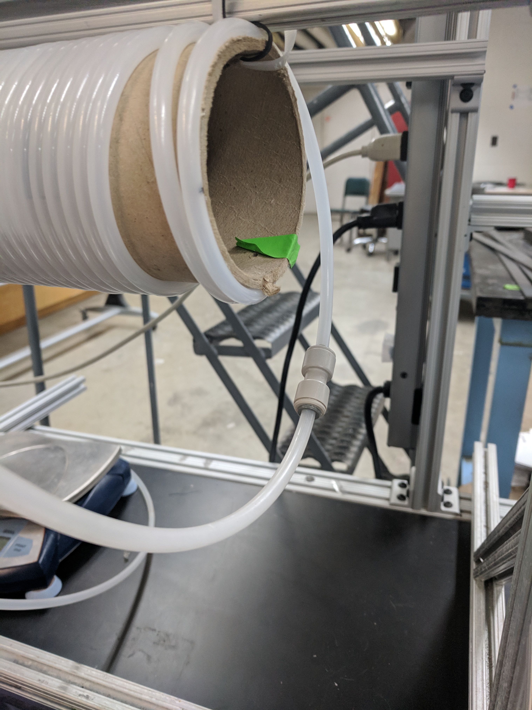
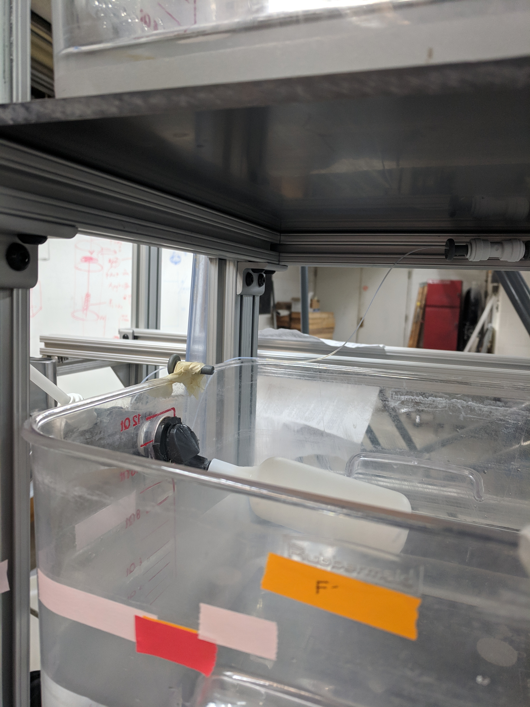

# Fluoride Gravity, Spring 2019
#### Sarah Huang, Cindy Jin, Simar Kohli
#### February 22, 2019
This publication Fluoride, Spring 2019 was developed under Assistance Agreement No. SU-83695001 awarded by the U.S. Environmental Protection Agency to Cornell University. It has not been formally reviewed by EPA. The views expressed in this document are solely those of Sarah Huang, Cindy Jin, and Simar Kohli and do not necessarily reflect those of the Agency. EPA does not endorse any products or commercial services mentioned in this publication.

**[Sidney: Hey team! I will be using bolded square brackets to comment on your manual.]**

## Abstract
Fluoride contamination of water is a significant issue faced by nations and people across the globe, and can **[Careful when using language like this, especially in a research report where it may not even be necessary. I would suggest removing "within multiple developing nations like India" as it does not add value to your report anyway.]**, lead to adverse consequences on health (e.g. muscle weakness and atrophy, weakness, fatigue). The Fluoride Gravity team’s **[Do not capitalize "Team". Team is not part of your name. You are the Fluoride Gravity team not the Fluoride Gravity Team.]** objective is to develop a cost-effective, self-sufficient mechanism for extracting excess fluoride from drinking water. The Spring 2019 team hopes to further the gravity-powered system’s efficacy and potentially begin to run field-tests with the device. **[Wording could be more formal (i.e. "The objective of the Fluoride Gravity team is..." or "to further the efficacy of the gravity-powered system's...")]** The application of such a device in real-world scenarios will be predicated upon success seen with the aforementioned field tests.

**[Very concise abstract. You use this section well!]**

**[Overall comment: Please remember to write in past tense throughout the manual as it would be someone in the future~ reading your final manual. Refer to Will's Technical Writing Presentation or our team's Grammar Guidelines on [Confluence](https://confluence.cornell.edu/display/AGUACLARA/Grammar+Guidelines+for+Reports).]**

## Introduction
The majority of AguaClara plants are located in Central America, where the sources of surface water originate from rivers and mountain streams. AguaClara's mission of providing access to safe drinking water for all has motivated the AguaClara team to expand and develop new goals **[I don't think we have any plants where their source is a lake... we focus on rivers and streams from mountains. Also, consider switching the ordering of your sentence to allow the paragraph to flow better. I.e. start with saying that the majority of AguaClara plants are in Central America and then mention that AguaClara's mission of providing access to safe drinking water for all has motivated us to expand and develop new goals.RESOLVED]**. By considering and analyzing the differences in drinking water collected from groundwater sources in other regions around the world, AguaClara can serve communities outside of Central America who are deprived of access to safe drinking water.

At some locations where there is little to no fluoride in drinking water, fluoride is added in for the purpose of strengthening teeth and deteriorating natural deposits [(NYC DEP, 2016)](http://www.nyc.gov/html/dep/pdf/wsstate16.pdf). However, there are detrimental consequences when there is an excess concentration of fluoride in the water being consumed by inhabitants in the area. For example, there has been moderate to high fluoride pollution in regions such as Algeria, Thailand, Ghana, India, and Iran, whose major source of drinking water comes from groundwater sources. The pollution of groundwater in these regions is due to the mobile dissolution of fluorite, apatite, and topaz from weathered rocks, increasing the levels of fluoride in the groundwater [(Bhattacharya and Samal, 2018)](http://www.isca.in/rjrs/archive/v7/i4/6.ISCA-RJRS-2018-028.pdf). The effects of consuming excess fluoride include dental, skeletal, developmental, neurological, endocrine, reproductive, and carcinogenic issues that affect the health of the communities in areas of high fluoride concentrations [(Bhattacharya and Samal, 2018)](http://www.isca.in/rjrs/archive/v7/i4/6.ISCA-RJRS-2018-028.pdf). Therefore, the World Health Organization (WHO) regulated the concentration limit for fluoride in drinking water to be 1.5 mg/L [(Water-related diseases, 2016)](https://www.who.int/water_sanitation_health/diseases-risks/diseases/fluorosis/en/).

In India, the Bureau of India Standards set an upper limit of fluoride concentrations in drinking water to be 1 mg/L [(Bureau of India Standards, 2012)](https://archive.org/details/gov.in.is.10500.2012). However, more than 65 million Indians consume drinking water above the recommended limit of 1.5 mg/L and some locations in India contain up to 20 mg/L, which risks the health of many communities [(LeChevallier and Au, 2004)](https://www.who.int/water_sanitation_health/publications/9241562552/en/).

AguaClara aspires to achieve the recommended limit of 1 mg/L or lower by the Bureau of India Standards and to implement the gravity-powered system of fluoride removal into the communities with excess concentrations of fluoride. The Fluoride Gravity team will be testing the gravity-powered apparatus with PACl and red dye substituted as fluoride to optimize fluoride removal to achieve residual concentration of less than 1 mg/L. If the gravity-powered fluoride removal apparatus operates in the optimal conditions of removing fluoride to a concentration of 1 mg/L, feasibility analysis on site will be performed to test whether the system can be used in the communities in India, which will allow AguaClara to provide access to safe drinking water in India and other locations that obtain water from groundwater sources.

**[Great Intro! Sums up your purpose very well.]**

## Literature Review
### Interaction between Polymeric Aluminum Hydroxide with Fluoride
When hydrolyzed, polyaluminum based coagulants, one of which is polyaluminum chloride, form mono- and polymeric species [(Gebbie, 2001)](http://wioa.org.au/conference_papers/2001/pdf/paper6.pdf). The interaction between aluminum hydroxide polymer and fluoride leads to the formation of several insoluble and soluble products depending on the ratio of total fluoride ion and aluminum ion concentrations, pH, and the total applied fluoride and aluminum concentrations [(Parthasarathy et al., 1986)](http://www.nrcresearchpress.com/doi/abs/10.1139/v94-310). When pH is less than 4, the predominant fluorocomplex is AlF due to the complete dissociation of polymeric aluminum. When the ratio of total fluoride ion and aluminum ion concentrations is between 0.5 and 1, fluoride is observed to precipitate, replacing some of the hydroxide ions ions in the aluminum hydroxide polymer. When the ratio of total fluoride ion and aluminum ion concentration is greater than 3, there is both precipitate and dissolved complexed fluoride present. It was observed that the optimal conditions for precipitating fluoride was a hydroxide to aluminum ratio of 2.5, a fluoride to aluminum ratio of 0,7, and a pH between 4 and 7.

### Mechanisms Governing Removal of Fluoride
Of the potential mechanisms that may play a role in the removal of fluoride with polyaluminum chloride, including surface adsorption, coprecipitation, and precipitation, it appears that coprecipitation is the main mechanism [(Kowalchuk, 2011)](https://digitalrepository.unm.edu/cgi/viewcontent.cgi?referer=https://www.google.com/&httpsredir=1&article=1059&context=ce_etds). Coprecipitation is the contamination of a precipitate by an impurity that is otherwise soluble under the conditions of precipitation [(Randtke in Kowalchuk, 2011)](https://digitalrepository.unm.edu/cgi/viewcontent.cgi?referer=https://www.google.com/&httpsredir=1&article=1059&context=ce_etds). Occlusion and surface adsorption play major roles in this process.

### Interactions Among Fluoride, NOM, and Alum During Coagulation Process
Experimental results from jar tests illuminate mechanisms of behind fluoroaluminum complexation [(Herrboldt, 2016)](https://repositories.lib.utexas.edu/bitstream/handle/2152/39194/HERRBOLDT-THESIS-2016.pdf?sequence=1). When fluoride was present in the system with alum, the residual aluminum increased significantly, indicating that fluoride is likely forming a soluble fluoroaluminum complex. In the removal of fluoride, NOM **[What is NOM? Define the terms that you use.]** caused a decrease in fluoride removal  from 50.1% to 45.8%, whereas NOM removal was inhibited by the presence of fluoride, indicated that it is likely outcompeting NOM for complexation with aluminum or adsorption to aluminum solids. In the precipitation of aluminum with fluoride, the particles are concentrated at smaller particle diameters, perhaps suggesting that fluoride may be inhibiting flocculation by acting as a stabilizing agent or by inhibiting precipitation. **[How does this inhibit flocculation? I am having a hard time following.]** It is hypothesized that fluoride prevents the growth of precipitates by inhibiting interactions between hydroxide and nearby particles. It is also hypothesized that, due to the way that fluoride can replace hydroxide in solids (Hao and Huang in [Herrboldt, 2016](https://repositories.lib.utexas.edu/bitstream/handle/2152/39194/HERRBOLDT-THESIS-2016.pdf?sequence=1)) **[Wrong way of using citation?? just say Herrboldt, 2016]**, the formation of aluminum hydroxide complexes is disrupted.

**[Please write more clearly. It is very difficult for me to follow the logic of this section.]**

### pH Dependence of Fluoride Removal
In a study by Gong et al. (2012), fluoroaluminum complexation was found to exhibit pH dependence. At pH values less than 5.0, almost all fluoride existed as fluoro-aluminum complexes, inhibiting its removal by coagulation. At pH levels greater than 8.0, fluoride almost exclusively as free fluoride, indicating that hydroxide has a greater affinity for aluminum at a higher pH [(Herrboldt, 2016)](https://repositories.lib.utexas.edu/bitstream/handle/2152/39194/HERRBOLDT-THESIS-2016.pdf?sequence=1).

### Collection and Analysis of Fluoride samples
An Ion-Selective Electrode (ISE) fluoride probe is used to measure the fluoride concentration of a sample. The following quality-control procedures should be followed.

ISE fluoride probes can only detect solubilized fluoride, and would give inaccurate readings in the presence of Fe3+ and Al3+, such as in cases where polyaluminum chloride is added to the system. Total Ionic Strength Adjusting Buffer (TISAB) solution is added to samples to solubilize the fluoride in the sample and keep the sample at a constant pH of 5-5.5. Temperature should be kept constant with less than a 1 degree Celsius deviation [(EPA Method 9214)](https://www.epa.gov/sites/production/files/2015-12/documents/9214.pdf).

Polyethylene containers, instead of glassware, should be used, since fluoride can adsorb to glass. An Initial Calibration Verification standard and a Continuing Calibration Verification standard should also be used, consisting of solutions of known fluoride concentration within the mean expected fluoride concentration that should be tested. The ICV should be used to test the accuracy of the calibration curve and the CCV should be sued after every 10 samples to ensure that the fluoride probe has not drifted from the calibration curve. These controls should be within 10% of their known values. A control blank containing one part water and one part TISAB should also be used to enhance the accuracy of data in future experiments.

**[Very thorough lit review, but some parts are hard to follow. You use really great vocabulary, but sometimes it doesn't lend itself to helping your points come across clearly. Remember that the purpose of a report is to communicate your research to a general audience.]**

## Previous Work
A coagulant-sedimentation system was developed to extract fluoride from contaminated water. Multiple tests have been run by past teams to analyze the efficacy of the designed filtration system using polyaluminum chloride (PACl) as a coagulant.

The Spring 2016 team continued to develop a more efficient filtration system by testing PACl with clay **[Clay is not a coagulant.] **[Define your acronyms. i.e. polyaluminum chloride (PACl)]** [(Longo, 2016)](https://drive.google.com/file/d/0B9yahrdDmfVpQ0t0M2NUUkRRNHM/view). While the team was successfully able to create a floc blanket, the Summer 2017 deemed clay to be not as neccessary as it increased the effluent turbidity of the system.. **[Clay is not a coagulant... it cannot be compared to PACl. You might benefit from talking to Tigran about this to clear up any confusion.]** [(Akpan et al., 2017)](https://github.com/AguaClara/Fluoride-Auto/blob/master/FluorideReportSp18.md), and therefore ran tests with just fluoride and PACl. However, it was soon realized that the system would begin to fail after just 10 hours. In conjunction with the Summer 2017 High Rate Sedimentation Team, a new reactor was able to boost the time to failure and allow for increased upflow velocities. It was determined that the most efficient upflow velocity was 1.5 $\mathrm{\frac{mm}{s}}$ [(Pang, 2018)](https://github.com/AguaClara/Fluoride_Gravity/blob/master/Fall%202018/Fluoride_Grav_Fall2018_Report.md#previous-work). The same team continued to conduct experiments with varying concentrations of PACl in order to develop an absorbance spectrum and determine the most effective concentration of PACl to be delivered to the system.

**Figure 1:** A Langmuir Adsorption Model fitting data from trials conducted by Fall 2017 team.

The 2018 cycle of teams managed to focus on developing a robust, gravity-powered filtration system [(Akpan et al., 2017)](https://github.com/AguaClara/Fluoride-Auto/blob/master/FluorideReportSp18.md).

**Figure 2:** A schematic for the gravity-powered system with differences in height generated power.

Some of the major designs of the model were created by the Spring 2018 team, and focused on deploying float valves to maintain a constant amount of water flowing through the system. Since the concentration of the PACl solution remained constant in the stock tank, a calculation of flow rate provided insight into the concentration of PACl actually entering in the system [(Pang, 2018)](https://github.com/AguaClara/Fluoride_Gravity/blob/master/Fall%202018/Fluoride_Grav_Fall2018_Report.md#previous-work).

The Summer 2018 team furthered the flexibility of the filtration system by including sliders for controlling height differences between different tanks and pipes. This provided the ability for teams to adjust the flow rate within the system.

**Figure 3:** Adjustments made by the Summer 2018 team to the set-up to allow for height variations. **[Great use of figure here! I like how everything is clearly labeled.]**

The Summer 2018 team continued to conduct tests on varying PACl concentrations and fitted new data to the Langmuir adsorption spectrum created by the Fall 2017 team. Concentrations of fluoride (range: 3 to 20 mg/L) and PACl (range: 10 to 50 mg/L) were tested. A Langmuir isotherm was applied to the data to obtain a new uptake vs effluent model [(Pang, 2018)](https://github.com/AguaClara/Fluoride_Gravity/blob/master/Fall%202018/Fluoride_Grav_Fall2018_Report.md#previous-work).

The following equation was used:
 $$ \frac{C_e}{q_e} = \frac{1}{q_e}C_e+\frac{1}{K_L\cdot q_m} $$

where $C_e$ is the equilibrium concentration of the adsorbant, $q_e$ is the amount adsorbed at equilibrium, and $K_L$ and $q_m$ are Langmuir constants which are related to adsorption capacity and energy of adsorption.

The Summer 2018 team continued to conduct tests on varying PACl concentrations and fitted new data to the Langmuir adsorption spectrum created by the Fall 2017 team. Concentrations of fluoride (range: 3 to 20 mg/L) and PACl (range: 10 to 50 mg/L) were tested. A Langmuir isotherm was applied to the data to obtain a new uptake vs effluent model (Pang, 2018).

The following equation was used:
 $$ \frac{C_e}{q_e} = \frac{1}{q_e}C_e+\frac{1}{K_L\cdot q_m} $$

where $C_e$ is the equilibrium concentration of the adsorbant, $q_e$ is the amount adsorbed at equilibrium, and $K_L$ and $q_m$ are Langmuir constants which are related to adsorption capacity and energy of adsorption.

**Figure 4:** A Langmuir isotherm fitted with data from the Summer 2018 team.

In Fall of 2018, two teams were made from the original Fluoride team: [Fluoride Gravity](https://github.com/AguaClara/Fluoride_Gravity) worked to make the gravity-powered apparatus more efficient, and [Fluoride Auto](https://github.com/AguaClara/Fluoride-Auto) spearheaded the development of an adsorption model by running more bench experiments [(Pang, 2018)](https://github.com/AguaClara/Fluoride_Gravity/blob/master/Fall%202018/Fluoride_Grav_Fall2018_Report.md#previous-work).

Finally, the Fall 2018 team prioritized developing a mechanism or process for measuring coagulant flow rate within the system. An IV drip was installed within the filtration system along with microtubing. While headloss still occurred, the team adjusted the height of the coagulant constant head tank to modify flow rate. The drip chamber was noted to substantially streamline the process of measuring flow rate [(Pang, 2018)](https://github.com/AguaClara/Fluoride_Gravity/blob/master/Fall%202018/Fluoride_Grav_Fall2018_Report.md#previous-work).

The goal of the Spring 2019 Fluoride team is to modify any neccessary parts to the filtration system developed over the past few years by previous Fluoride teams, begin to run comprehensive tests on red-dye within the system, and finally proceed to testing fluoride solutions within the filtration system, itself. 

**[At the end of this section, you should be tying the previous work to the goals of your team for this semester. Briefly explain how your team will be building off of previous work.]**

## Methods
### Experimental Apparatus
The gravity-powered apparatus was constructed as according to the fabrication manual in the Fluoride Gravity Fall 2018 report.

Several changes were made to optimize the ease of use of the apparatus. The IV drip chamber was removed due to previous difficulties in starting the system, The T-joint was removed, allowing the fluoride constant head tank to be directly connected to the flocculator.

**Figure 5:** New connection linking the fluoride constant head tank with the flocculator. **[Consider circling the fitting you are referring to in the figure in red to make it even clearer what connection you are talking about. This can be done on Google Drawings.]**

In place of the IV drip chamber, microbore tubing connected to the PACl constant head tank was used to drip PACl directly in the fluoride constant head tank at a constant rate, mixing with the fluoride and beginning the coagulation process. This change allowed the PACl and fluoride systems to become decoupled.

**Figure 6:** Microbore tubing connected to the PACl system allows PACl to drip directly into the fluoride constant head tank. **[The micro-tubing here is really hard to see. Same as previous comment, consider circling it in red.]**

The system was tested with red dye in place of PACl and water to determine the extent of mixing, and it was observed that the fluoride constant head tank became a homogenous red mixture, coloring the waste line red as well, implying that the dye was able to be well mixed in the fluoride constant head tank under this new construct.

## Results and Analysis
### Determining the Effectiveness of New System
#### Determining Coagulant Flow Rate
The flow rate of PACl was determined to have a linear relationship with the height differential between the fluoride constant head tank and the PACl constant head tank by the [Fluoride Gravity Fall 2018 team](https://github.com/AguaClara/Fluoride_Gravity/blob/master/Fall%202018/Fluoride_Grav_Fall2018_Report.md#measuring-coagulant-flow-rate).
It was hypothesized that the decoupled PACl system would exhibit the same linear relationship with the change in height. The flow rate of the PACl entering the decoupled fluoride system was determined in two different methods: gravimetrically and volumetrically.

#### Gravimetric Method
 The flow rate of the coagulant was determined by measuring the change in mass of the PACl stock tank over a period of time. This was then converted to volumetric flow rate. The balance was connected to ProCoDA to measure the change in mass. The volumetric flow rate of the PACl coagulant entering the fluoride system was measured at several height differences (Figure 7).

**Figure 7:** The flow rate of the PACl system was plotted against the change in height between the fluoride constant head tank and the PACl constant head tank. The data exhibits a strong positive correlation, indicating a direct relationship between flow rate and change in height. **[Refer to your figure in the body of this section so that if someone is skimming through your report, they can easily pinpoint which figure goes with what information.RESOLVED]**

#### Volumetric Method

Using a 10 mL graduated cylinder, the flow rate of the PACl entering the fluoride system was also determined by measuring the time the PACl coagulant took to drip into the fluoride system to a volume of 2 mL. The flow rate of the PACl entering the fluoride system was measured while varying the height difference between the fluoride constant head tank and the PACl constant head tank and doing three trials for each height difference. The data also exhibits a strong positive correlation indicating a direct relationship between flow rate and the difference in height between the coagulant constant head tank and the fluoride constant head tank (Figure 8).

**Figure 8:** The flow rate of the PACl system versus the difference in height between the fluoride constant head tank and the PACl constant head tank graph displaying a strong correlation between flow rate and change in height.

The strong correlations using the two different methods in determining the flow rate of PACl entering the fluoride system implies that the relationship in the decoupled system operates in the same manner as the previously linked system with the IV drip chamber.

#### Comparison Between Gravimetric Method and Volumetric Method

The value of the coefficient of determination, R^2, was lower in the volumetric analysis graph than the R^2 value of the gravimetric analysis graph of the PACl flow rate versus height (Figure 7). Therefore, the gravimetric method's data is more accurate due to using ProCoDA and a mass balance with automated time and mass readings while the volumetric analysis was estimated with the human eye and timed manually. 

The determination of the coagulant flow rate was used to control and optimize the concentration of PACl entering the fluoride system.

#### Determining Binding of PACl
The system was run in reverse, with red dye run through the PACl system to determine the extent of mixing. PACl solution was added to the fluoride system to determine the extent of coagulation and whether the solution would successfully flocculate. The system was run with a upflow velocity of 0.76 mL/s.

The red dye appeared to coagulate at the surface of the constant head tank. The water entering the flocculator was less red than the water in the constant head tank, implying that precipitation occurred in the constant head tank, disallowing flocculation to occur.

<!--## Future Work
<!---Describe your plan of action for the next several weeks of research. Detail the next steps for this team. How can AguaClara use what you discovered for future projects? Your suggestions for challenges for future teams are most welcome. Should research in this area continue?-->

**[Hey team! Great start. I think the Lit Review section can get a bit dense, so try to go back to see if there are parts that you can improve and focus on making sure the logic of your points flow well. There seemed to be some confusion in your Previous Work section, so just make sure to follow up with Tigran and clear that up. Good use of figures, but could be improved. Also, do not restart numbering of figures as Tigran mentioned. Please address my and Tigran comments for the next report and you should be good to go! Excited to see your work progress through the semester 😃]**

## Bibliography
Akpan, P., Mehrabyan, T,. Sausele, D., & Zhang, V. (2018). Fluoride, Spring 2018. Retrieved from https://github.com/AguaClara/Fluoride-Auto/blob/master/FluorideReportSp18.md.

Bhattacharya, P., & Samal, A. (2018, April). Fluoride contamination in groundwater, soil and cultivated foodstuffs of
India and its associated health risks: A Review. Research Journal of Recent Sciences, 7(4),36-47. Retrieved from http://www.isca.in/rjrs/archive/v7/i4/6.ISCA-RJRS-2018-028.pdf.
Bureau of Indian Standards. (2012). IS 10500: Drinking water. Retrieved from https://archive.org/details/gov.in.is.10500.2012/page/n3.

EPA Method 9214. (1996, December). Retrieved from https://www.epa.gov/sites/production/files/2015-12/documents/9214.pdf.

Gebbie, P. (2001). Using Polyaluminium Coagulants in Water Treatment. Retrieved from http://wioa.org.au/conference_papers/2001/pdf/paper6.pdf.

Herrboldt, J. P. (2016). Fluoride, Natural Organic Matter, and Particles: The Effect of Ligand Competition on the Size Distribution of Aluminum Precipitates in Flocculation. Retrieved from https://repositories.lib.utexas.edu/bitstream/handle/2152/39194/HERRBOLDT-THESIS-2016.pdf?sequence=1.

Kowalchuk, E. E. (2011). Selective Fluoride Removal by Aluminum Precipitation and Membrane Filtration. Retrieved from https://digitalrepository.unm.edu/cgi/viewcontent.cgi?referer=https://www.google.com/&httpsredir=1&article=1059&context=ce_etds.

LeChevallier, M. W., & Au, K. (2014, December 10). Water treatment and pathogen control: Process efficiency in achieving safe drinking water. Retrieved from https://www.who.int/water_sanitation_health/publications/9241562552/en/.

Longo, A., Desai, D., & Dao, K. (2016). Fluoride Floc Blanket, Spring 2016. Retrieved from https://drive.google.com/file/d/0B9yahrdDmfVpQ0t0M2NUUkRRNHM/view.

Pang, C., Sarmiento, K., & Tsang, C. (2018). Fluoride Gravity, Fall 2018. Retrieved from https://github.com/AguaClara/Fluoride_Gravity/blob/master/Fall%202018/Fluoride_Grav_Fall2018_Report.md.

Parthasarathy, N., Buffle, J., & Haerdi, W. (1986). Study of interaction of polymeric aluminium hydroxide with fluoride. Canadian Journal of Chemistry, 64(1), 24-29. doi:10.1139/v86-006.

United States, NYC Environmental Protection. (2016). New York City 2016 Drinking Water Supply and Quality Report. New York. Retrieved from http://www.nyc.gov/html/dep/pdf/wsstate16.pdf.

World Health Organization. (2016, August 29). Water-related diseases. Retrieved from http://www.who.int/water_sanitation_health/diseases-risks/diseases/fluorosis/en/.
